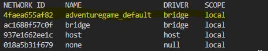
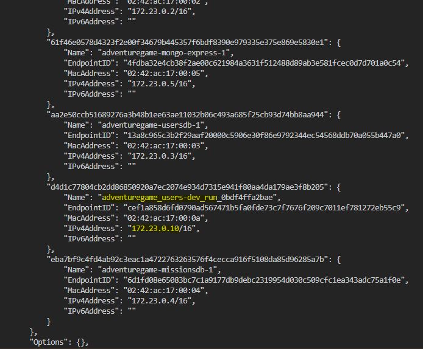
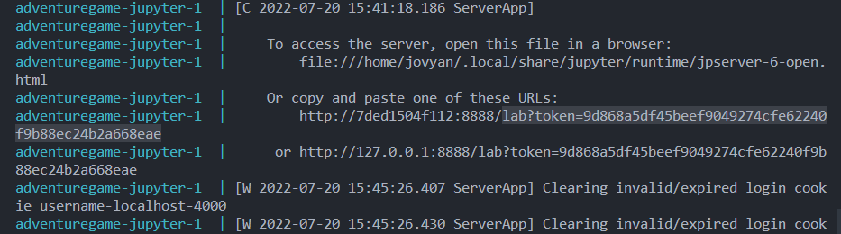

# AdventureGame
Aplicação Web de um jogo de aventura estilo RPG de mesa

# Passo a Passo inicializacao dos microsservicos
1. Na pasta root monte a imagem docker com o comando:
```
docker-compose --profile <ambiente> up -d
```
Substitua "ambiente" pelo ambiente de desenvolvimento desejado (development ou production)

2. Ambiente development
2. 1. A seguir rode o servidor desejado utilizando o comando:
```
docker-compose --profile testing run --rm <NOME_DO_CONTEINER_DE_AMBIENTE_NODE_CRIADO> <COMANDO_INICIALIZACAO>
```
NOME_DO_CONTEINER_DE_AMBIENTE_NODE_CRIADO:
users-dev: microsserviço de auth e usuarios
characters-dev: microsserviço de personagens
missions-dev: microsserviço de missoes

COMANDO_INICIALIZACAO:
npm run dev: microsserviço de auth e usuarios
npm start: microsserviço de personagens
npm start: microsserviço de missoes

2. 2. Procure o ip do microsservico
Com o codigo abaixo procure o nome do container do projeto
```
docker network ls
```


A seguir procure o ip do microsserviço desejado com o comando:
```
docker network inspect <NOME_CONTAINER>
```
No caso do exemplo, "NOME_CONTAINER" seria adventuregame_default.
Na imagem abaixo, escolhemos o microsservico de users, que foi iniciado no passo 2.1, e procuramos seu endereço de IP que será utilizado para fazer a requisicao



2. 3. Inicie o jupyter para fazer as requisicoes

Como houve um problema para o mapeamento de portas utilizando o docker para os microsservicos. Utilizamos o notebook jupyter para realizar o mesmo.
Primeiramente roda-se o codigo abaixo e copie o token marcado na imagem.

```
docker-compose --profile testing logs jupyter
```


Então, acesse o jupyter, de onde serão feitas as requisições, através do endpoint a seguir:
```
localhost:4000/<TOKEN>
```

Dentro do jupyter, copie e rode esse primeiro bloco de código:

```
from requests import get, post, put, delete
import json

def Interact(method, url, body=None):
    if body:
        response = method(url,data=json.dumps(body),headers={"content-type":"application/json"})
    else:
        response = method(url)
    if response.status_code != 200:
        print("Error: Status code "+ str(response.status_code))
    try:
        return response.json()
    except:
        return response.text
```

E na linha seguinte monte a requisicao:

```
body = {"atributo1": "valor1", "atributo2": "atributo2"}

Interact(post, "<IP>/<ENDPOINT>", body)
```
Em que, "IP" é o copiado no passo anterior e "ENDPOINT" e a rota desejada.
Por exemplo, no caso do users, caso deseja-se fazer um cadastro teremos a seguinte requisicao:
```
body = {"username": "teste", "password": "teste"}

Interact(post, "http://172.23.0.10:3000/register", body)
```

3. Teste ambiente de Desenvolvimento
Para rodar os testes de o comando:
```
docker-compose --profile testing run --rm <NOME_DO_CONTEINER_DE_AMBIENTE_NODE_CRIADO> npm test
```

4. Ambiente de Producao